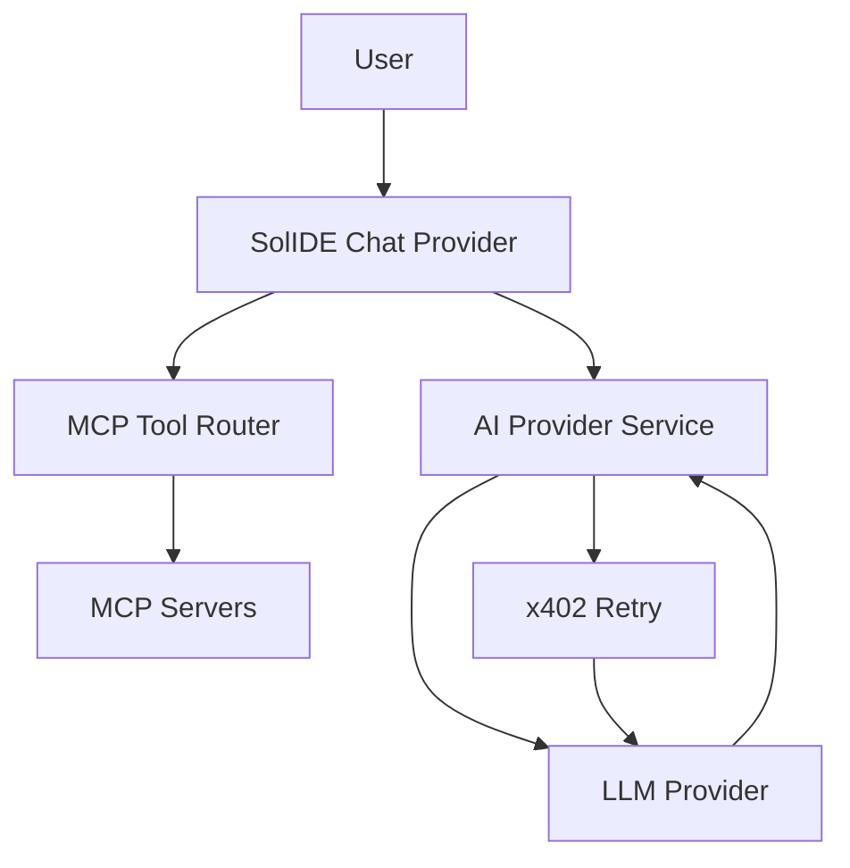

## Executive summary
SolIDE’s highest-risk surfaces in scope are the **agent loop** (LLM requests + streaming tool calls), **MCP tool execution**, and **x402 payment retry** handling. The dominant risk themes are (1) **tool/prompt injection leading to unintended privileged actions**, (2) **secrets and payment credential exposure via logs/UI**, and (3) **supply-chain / remote-tool integrity** when calling external MCP servers.

## Scope and assumptions
- **In-scope paths**
  - `vscode/src/vs/workbench/services/aiProvider/common/aiProviderService.ts`
  - `vscode/src/vs/workbench/services/aiProvider/common/mcpToolRouter.ts`
  - `vscode/src/vs/workbench/services/aiProvider/common/x402Http.ts`
  - `vscode/src/vs/workbench/contrib/chat/browser/solanaIdeLanguageModel.contribution.ts`
  - `vscode/.cursor/mcp.json`
  - `vscode/product.json`
- **Out of scope (for A)**: Solana Wallet / Explorer / Anchor workflows and any transaction signing flows.
- **Assumptions (unvalidated)**
  - The app is primarily a **local desktop IDE** (Electron) with user-driven UI; there is no intentional remote access to the agent loop.
  - x402 payments are **manual paste-and-retry** (no automatic signing in-app).
  - MCP servers can be **stdio** (local) or **http** (remote) based on `.cursor/mcp.json`.
- **Open questions that would materially change risk**
  - Will SolIDE expose any agent/tool endpoints over the network (shared IDE sessions, remote control, “agent server”)?
  - Will x402 move from paste-and-retry to **automatic** on-device signing?
  - Will you allow arbitrary MCP servers by default, or enforce a strict allowlist?

## System model
### Primary components
- **Chat model provider (SolIDE)**: Implements `ILanguageModelChatProvider` and loops over tool calls. Evidence: `vscode/src/vs/workbench/contrib/chat/browser/solanaIdeLanguageModel.contribution.ts`
- **AI provider service**: Sends LLM requests to OpenAI-compatible endpoints (OpenRouter/OpenAI/Daemon/Ollama) and parses streaming deltas incl. `tool_calls`. Evidence: `vscode/src/vs/workbench/services/aiProvider/common/aiProviderService.ts`
- **x402 readiness layer**: Detects HTTP 402 and preserves headers/body in a structured error. Evidence: `vscode/src/vs/workbench/services/aiProvider/common/x402Http.ts`
- **MCP tool router**: Exposes MCP tools as OpenAI “function tools” and executes tool calls after approval. Evidence: `vscode/src/vs/workbench/services/aiProvider/common/mcpToolRouter.ts`
- **MCP server configuration**: Declares configured MCP servers (stdio + http). Evidence: `vscode/.cursor/mcp.json`

### Data flows and trust boundaries
- **User → SolIDE Chat UI → Agent loop**
  - **Data**: prompts, workspace context, approvals.
  - **Channel**: in-process.
  - **Guarantees**: implicit local user; approval prompt exists for tool execution. Evidence: `mcpToolRouter.ts` approval `pick()`.
- **SolIDE → LLM provider (OpenRouter/OpenAI-compatible)**
  - **Data**: prompts, tool schemas, tool results, model outputs.
  - **Channel**: outbound HTTPS (or configured base URL). Evidence: `_sendOpenAiCompatible()` in `aiProviderService.ts`.
  - **Guarantees**: API key from secret storage; no explicit per-request redaction beyond not logging headers. Evidence: `_getApiKey()` uses `ISecretStorageService`.
- **LLM provider → SolIDE (streaming)**
  - **Data**: streamed deltas, tool calls, usage.
  - **Channel**: HTTP response stream (SSE-like). Evidence: `_postOpenAiStreaming()` line parsing of `data:`.
  - **Guarantees**: JSON parsing best-effort; tool call arguments parsed from JSON string.
- **SolIDE → MCP servers**
  - **Data**: tool name + args; potentially sensitive outputs.
  - **Channel**: local stdio or remote HTTP depending on server type. Evidence: `.cursor/mcp.json` includes `type: "stdio"` and `type: "http"`.
  - **Guarantees**: user approval; allowlist policy for servers/tools (deny by policy). Evidence: `solide.ai.mcp.allowedServers/tools` usage in `mcpToolRouter.ts`.
- **SolIDE ↔ x402 payment-required**
  - **Data**: `PAYMENT-REQUIRED` header, pasted `PAYMENT-SIGNATURE`.
  - **Channel**: HTTP 402 then retry once. Evidence: 402 branch in `_postOpenAiStreaming()` and `fetchWithX402Readiness()`.

#### Diagram

## Assets and security objectives
| Asset | Why it matters | Security objective (C/I/A) |
| --- | --- | --- |
| LLM API keys (OpenRouter/OpenAI/Daemon/etc.) | Key theft enables account abuse and bill shock | C |
| MCP credentials/headers (e.g. Range key via env) | Can authorize sensitive investigations / data access | C |
| Tool execution authority (approval UX) | Integrity of developer workstation and workflow | I |
| Payment artifacts (`PAYMENT-SIGNATURE`) | Enables payment/settlement; could be reused if replayable | C/I |
| Workspace contents in prompts/tool results | Source code/IP leakage to providers/tools | C |
| Audit logs / output console | Leaks secrets, tool outputs, payment requirements | C/I |

## Attacker model
### Capabilities
- Remote attacker can influence **LLM outputs** (prompt injection via user-supplied content, model behavior, or remote MCP tool output).
- A malicious/compromised MCP server can return crafted content to steer subsequent tool calls.
- A network attacker can cause HTTP errors/402 and trigger payment flows (but not break TLS, assumed).

### Non-capabilities
- No assumed OS-level compromise or ability to bypass OS secret storage without local access.
- No assumed ability to silently click “Approve” unless UI is automated by user or compromised extensions.

## Entry points and attack surfaces
| Surface | How reached | Trust boundary | Notes | Evidence (repo path / symbol) |
| --- | --- | --- | --- | --- |
| LLM request payload | User chat → provider | Local → Internet | Includes tools + tool results | `aiProviderService.ts` `_sendOpenAiCompatible()` |
| Streaming parser | Provider response | Internet → local app | Parses `data:` lines; JSON best-effort | `aiProviderService.ts` `_postOpenAiStreaming()` |
| Tool call execution | Tool router | Model output → privileged actions | Approval prompt + allowlist policy | `mcpToolRouter.ts` `executeTool()` |
| x402 retry | 402 handler | Provider → local app | Prompts user for payment signature | `aiProviderService.ts` 402 branch + `x402Http.ts` |
| MCP server config | `.cursor/mcp.json` | Workspace config → tool surface | Adds http servers and headers | `vscode/.cursor/mcp.json` |

## Top abuse paths
1) **Prompt injection → unintended MCP tool call**
   1. Attacker-controlled text in chat context instructs the model to call a high-impact tool.
   2. Model emits `tool_use` with plausible parameters.
   3. User misclicks Approve or habituates to approval prompts.
   4. Tool executes, returning sensitive data; model exfiltrates via LLM response.
2) **Malicious MCP server output → chained tool calls**
   1. Tool returns crafted output that looks like system instruction.
   2. Model uses output as input and calls more tools.
   3. Repeated approvals lead to privilege escalation / data leakage.
3) **x402 social engineering / payment replay**
   1. 402 triggers payment prompt with decoded “requirements”.
   2. User pastes a `PAYMENT-SIGNATURE` from an external tool/script.
   3. Signature/tx is reused or redirected if the user is tricked into paying a different endpoint.
4) **Tool schema abuse**
   1. Tool exposes overly-broad schema (e.g., arbitrary URL fetch).
   2. Model uses tool to access internal network resources (SSRF-like) if tool permits.
5) **Leak via logs/telemetry**
   1. Tool results or payment headers are logged.
   2. Logs are shared or uploaded during bug report.

## Threat model table
| Threat ID | Threat source | Prerequisites | Threat action | Impact | Impacted assets | Existing controls (evidence) | Gaps | Recommended mitigations | Detection ideas | Likelihood | Impact severity | Priority |
| --- | --- | --- | --- | --- | --- | --- | --- | --- | --- | --- | --- | --- |
| TM-001 | Prompt injection | User pastes/opens attacker-controlled text into chat context | Coerce model to emit tool calls | Data exfiltration or harmful tool actions | Workspace data, tool authority | Approval prompt in `executeTool()` | Approval fatigue; no risk tiering | Add per-tool risk tiers + “always require explicit confirm for high-risk”; show full args diff; default deny for unknown tools | Log tool calls with server/tool/args hash + approval decision | medium | high | high |
| TM-002 | Malicious MCP server | Remote MCP server configured and allowed | Return crafted outputs to steer further tool calls | Confidential data leakage; integrity issues | Workspace data, MCP creds | Allowlist settings `solide.ai.mcp.allowedServers/tools` | Default tool allowlist still `*` | Tighten defaults for tool allowlist; require pinning/trust for http MCP servers; show server origin in approval UI | Alert when tool outputs exceed size thresholds or contain secrets patterns | medium | high | high |
| TM-003 | x402 phishing/replay | 402 occurs; user pastes signature | Trick user into paying wrong requirement or replayable payload | Financial loss; potential auth token leakage | Payment signature, wallet funds | Manual paste step; 402 headers captured | No binding of signature to URL; no nonce tracking | Bind payment signature to (url, accepted requirement) before retry; store recent nonces/tx ids to prevent repeated retries; show payTo/asset/amount clearly | Log 402 events + selected accept option (redacted) | medium | medium | medium |
| TM-004 | Tool output exfil | Tool returns sensitive data | Model includes tool output in LLM request/response | Secret/code leakage | Workspace, MCP outputs | None explicit | No output redaction / classification | Add output redaction policy (API keys, private keys, tokens); cap tool output length sent back to model; require user consent for “send output to model” | Detect high-entropy tokens in outgoing requests; warn user | high | high | critical |
| TM-005 | Supply chain / server integrity | MCP server binary or http endpoint compromised | Execute unintended behavior | Full compromise depending on tool | System integrity | MCP trust model exists upstream | Router doesn’t enforce signature/pinning | Require explicit trust for new servers; display command/url in UI; optionally require signed configs | Log server start + origin; anomaly on changes | low | high | medium |

## Criticality calibration
- **critical**: leakage or misuse that can expose secrets/source or cause irreversible damage with high plausibility (e.g., tool output exfiltration of keys).
- **high**: tool injection that can execute privileged actions with moderate plausibility, or sensitive MCP outputs from remote servers.
- **medium**: payment misuse that is user-mediated, or integrity issues requiring multiple missteps.
- **low**: issues requiring local compromise or unlikely preconditions.

Examples:
- **critical**: TM-004 (tool output sent to LLM without redaction).
- **high**: TM-001/TM-002 (prompt/tool injection + remote MCP).
- **medium**: TM-003 (x402 paste-and-retry misuse).

## Focus paths for security review
| Path | Why it matters | Related Threat IDs |
| --- | --- | --- |
| `vscode/src/vs/workbench/services/aiProvider/common/aiProviderService.ts` | LLM request/stream parsing; tool call parsing; x402 prompt+retry | TM-001, TM-003, TM-004 |
| `vscode/src/vs/workbench/services/aiProvider/common/mcpToolRouter.ts` | Tool exposure policy + approval UI + execution | TM-001, TM-002 |
| `vscode/src/vs/workbench/services/aiProvider/common/x402Http.ts` | 402 detection and header/body handling | TM-003 |
| `vscode/.cursor/mcp.json` | Defines which MCP servers exist and how they auth | TM-002, TM-005 |
| `vscode/src/vs/workbench/contrib/chat/browser/solanaIdeLanguageModel.contribution.ts` | Agent loop orchestration; tool_result wiring | TM-001, TM-004 |

## Notes on use
- This threat model is scoped to the **agent/tooling core**. Wallet signing, Anchor workflows, and Solana RPC actions are intentionally excluded and are modeled in B.

