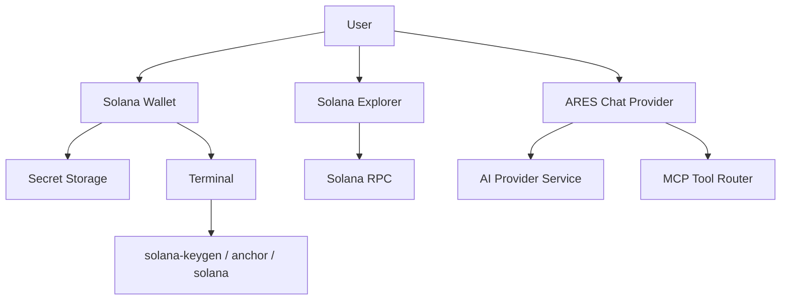

## Executive summary
Threat model B extends A by including Solana developer workflows that interact with **keys**, **RPC endpoints**, and **terminal-command execution** (Anchor and Solana CLI). This scope introduces higher-severity, higher-likelihood threats: **key exfiltration**, **malicious transaction signing**, **unsafe terminal command execution**, and **RPC endpoint trust / integrity** risks.

## Scope and assumptions
- **In-scope paths (B adds to A)**
  - `vscode/src/vs/workbench/contrib/solanaWallet/browser/solanaWallet.contribution.ts`
  - `vscode/src/vs/workbench/contrib/solanaWallet/common/solanaKeypair.ts`
  - `vscode/src/vs/workbench/contrib/anchor/browser/anchor.contribution.ts`
  - `vscode/src/vs/workbench/contrib/solanaExplorer/browser/solanaExplorer.contribution.ts`
  - `vscode/src/vs/workbench/contrib/solana/common/solanaConfiguration.ts`
- **Assumptions (unvalidated)**
  - Solana Wallet stores secret keys via `ISecretStorageService` and uses `solana-keygen` to generate keys.
  - Anchor and wallet features use the integrated terminal and run commands in the user’s shell context.
  - RPC URL is user-configurable and defaults to devnet.
- **Open questions**
  - Will wallet features ever sign and send **mainnet** transactions by default?
  - Will ARES allow extensions/agents to trigger wallet/anchor actions non-interactively?
  - Should the IDE enforce an allowlist of RPC endpoints?

## System model
### Primary components (B additions)
- **Solana Wallet contribution**
  - Generates keypairs via `solana-keygen new ... -o "<tmp>.json"` and imports keypairs, storing secret key JSON in secret storage. Evidence: `solanaWallet.contribution.ts` `SolanaWalletCommandId.Generate` and `ISecretStorageService.set(...)`.
- **Anchor workflow contribution**
  - Runs `anchor build/test/deploy` and scaffolds projects via terminal commands (`anchor init ...`). Evidence: `anchor.contribution.ts` `runAnchorTerminalCommand()`.
- **Solana Explorer contribution**
  - Performs JSON-RPC calls directly to configured `solide.solana.rpcUrl`. Evidence: `solanaExplorer.contribution.ts` `rpcCall()` using `fetch(rpcUrl, ...)`.
- **Solana config schema**
  - Defines RPC URL + wallet active keypair settings. Evidence: `solanaConfiguration.ts`.

### Data flows and trust boundaries (new/changed)
- **User → Wallet UI → Secret storage**
  - **Data**: imported secret key (JSON/base58) or generated key JSON file, active alias.
  - **Boundary**: UI input → persistent secret store.
  - **Evidence**: `solanaWallet.contribution.ts` uses `ISecretStorageService.set('solide.wallet.<alias>', secretKeyJson)`.
- **Wallet → Terminal → `solana-keygen`**
  - **Data**: command string executed in terminal.
  - **Boundary**: app → shell execution.
  - **Evidence**: `runTerminalCommand()` sends sequences; `solana-keygen new ...`.
- **Anchor workflow → Terminal → `anchor` / `solana`**
  - **Data**: command strings, project name, network selection.
  - **Boundary**: app → shell execution.
  - **Evidence**: `anchor.contribution.ts` `anchor init`, `solana config set`.
- **Explorer → RPC endpoint**
  - **Data**: user-provided addresses/signatures; RPC results.
  - **Boundary**: app → remote RPC.
  - **Evidence**: `solanaExplorer.contribution.ts` `rpcCall()` uses configured URL.

#### Diagram

## Assets and security objectives
| Asset | Why it matters | Security objective (C/I/A) |
| --- | --- | --- |
| Solana secret keys (wallet keypairs) | Compromise enables fund theft / signing malicious tx | C |
| RPC endpoint trust | Malicious RPC can mislead user and tamper responses | I |
| Terminal execution surface | Command injection can lead to system compromise | I |
| Anchor project scaffolds | Writes files; could be used to plant malicious code | I |
| Wallet alias + active selection | Wrong key usage can cause loss / mis-deploy | I |

## Attacker model
### Capabilities
- Attacker can influence user inputs (clipboard paste, addresses, tx ids, paths).
- Attacker can influence model outputs and tool outputs (from A).
- Attacker can control a configured RPC endpoint if user is tricked into changing RPC URL.

### Non-capabilities
- No assumed ability to break OS keychain/secret storage without local access.
- No assumed ability to replace `anchor`/`solana` binaries unless supply chain/local path is compromised.

## Entry points and attack surfaces
| Surface | How reached | Trust boundary | Notes | Evidence (repo path / symbol) |
| --- | --- | --- | --- | --- |
| Key import textbox | Wallet UI | User input → secret store | Accepts JSON/base58 secret key | `solanaKeypair.ts` `parseSecretKey()` |
| Key generation | Wallet command | App → terminal → filesystem | Writes keypair to tmp, reads it, deletes | `solanaWallet.contribution.ts` `waitForKeypairFile()` |
| Anchor commands | Anchor workflow | App → terminal | `anchor build/test/deploy/init` | `anchor.contribution.ts` `runAnchorTerminalCommand()` |
| RPC URL | Settings | User config → remote network | Used for explorer/wallet RPC calls | `solanaConfiguration.ts` `SolanaSettingId.RpcUrl` |
| Explorer lookup | Explorer command | User input → RPC | No validation beyond fetch | `solanaExplorer.contribution.ts` `rpcCall()` |

## Top abuse paths
1) **Malicious prompt/tool injection → wallet key exfil**
   1. Model convinces user to export/paste secret key.
   2. Secret key ends up in chat/logs/tool output.
   3. Funds stolen.
2) **Terminal command injection via untrusted values**
   1. Any feature interpolates attacker-controlled strings into terminal commands.
   2. Shell interprets injected syntax.
   3. Local compromise.
3) **RPC endpoint substitution**
   1. User is convinced to change `solide.solana.rpcUrl` to attacker RPC.
   2. Explorer/wallet shows manipulated results.
   3. User signs/sends based on false data.
4) **Keypair parsing ambiguity**
   1. User imports malformed base58/JSON secret key.
   2. Wrong public key derived; user funds wrong address.
5) **Anchor scaffold in unsafe directory**
   1. Scaffold runs in a path with unexpected permissions/symlinks.
   2. Files written where they shouldn’t be; possible persistence.

## Threat model table
| Threat ID | Threat source | Prerequisites | Threat action | Impact | Impacted assets | Existing controls (evidence) | Gaps | Recommended mitigations | Detection ideas | Likelihood | Impact severity | Priority |
| --- | --- | --- | --- | --- | --- | --- | --- | --- | --- | --- | --- | --- |
| TM-101 | Tool/prompt injection | User interacts with agent + wallet features | Coerce disclosure of secret key | Funds theft | Solana secret keys | Secrets stored in secret storage | No “never reveal” policy enforced in UI | Add hard UI guardrail: never display/export secret keys in chat; add “sensitive action” confirmations | Warn on detecting 64-byte key JSON in chat/clipboard | medium | high | high |
| TM-102 | Command injection | Any untrusted string reaches terminal sendSequence | Execute arbitrary shell commands | Local compromise | System integrity | Some quoting used in commands | Not all commands are shell-safe; sendSequence executes raw text | Centralize terminal command building; strict escaping; block newlines/`;|&` in user-provided parts | Log and alert on suspicious characters in terminal sequences | low | high | medium |
| TM-103 | Malicious RPC | User changes rpcUrl or network attacker MITM | Tamper RPC responses | User misled; wrong actions | RPC trust, user decisions | HTTPS default; configurable URL | No endpoint allowlist/pinning; limited validation | Add optional allowlist + warnings for non-https; show RPC host prominently; add response sanity checks | Log rpc host changes; detect frequent failures | medium | medium | medium |
| TM-104 | Key import misuse | User imports wrong/invalid format | Wrong address used | Loss of funds | Key integrity | `validateBase58PublicKey()` and length checks | No checksum/derivation verification beyond slicing | Verify imported secret key matches derived pubkey; show pubkey and require confirm | Record import + derived pubkey; warn on duplicates | medium | medium | medium |
| TM-105 | Anchor init side effects | User runs scaffold in sensitive dir | Writes files / overwrites | Integrity compromise | Workspace filesystem | Unique naming; waits for Anchor.toml | No sandboxing of filesystem writes | Prompt for target directory; restrict to workspace/user home; detect symlinks | Log project creation paths | low | medium | low |

## Criticality calibration
- **critical**: credible paths to secret key theft or arbitrary code execution without strong user intent.
- **high**: workflows that handle keys/commands with user involvement but high impact.
- **medium**: RPC integrity and misconfiguration leading to bad decisions.
- **low**: integrity issues with constrained scope/likelihood.

## Focus paths for security review
| Path | Why it matters | Related Threat IDs |
| --- | --- | --- |
| `vscode/src/vs/workbench/contrib/solanaWallet/browser/solanaWallet.contribution.ts` | Terminal command execution + secret storage writes | TM-101, TM-102 |
| `vscode/src/vs/workbench/contrib/solanaWallet/common/solanaKeypair.ts` | Secret key parsing/validation assumptions | TM-104 |
| `vscode/src/vs/workbench/contrib/anchor/browser/anchor.contribution.ts` | Terminal command execution + filesystem scaffold | TM-102, TM-105 |
| `vscode/src/vs/workbench/contrib/solanaExplorer/browser/solanaExplorer.contribution.ts` | RPC fetch path + user-provided identifiers | TM-103 |
| `vscode/src/vs/workbench/contrib/solana/common/solanaConfiguration.ts` | RPC URL setting central to trust | TM-103 |

## A→B delta (what changed vs A)
- **New high-value assets**: Solana secret keys, CLI execution authority, RPC trust.
- **New top risks**: key exfiltration (TM-101) and terminal injection (TM-102).
- **New recommended controls**: sensitive-action UI guardrails, command-escaping centralization, RPC allowlist/warnings.

