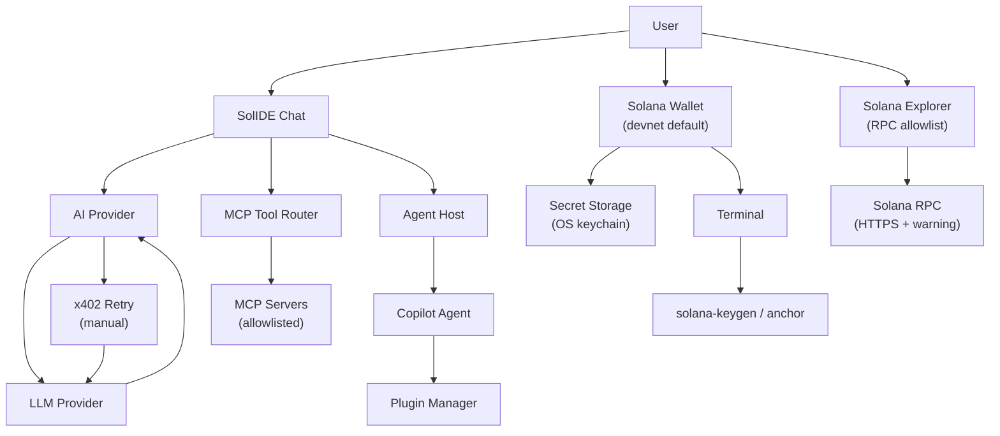

# daemon-IDE Threat Model

## Executive summary

SolIDE is a VS Code fork for Solana blockchain development with integrated AI agent capabilities. The highest-risk surfaces are the **agent loop** (LLM + MCP tool execution), **Solana wallet key management**, **terminal command execution**, and **supply chain integrity**. Dominant risk themes: (1) **tool/prompt injection leading to key exfiltration**, (2) **tool output exfiltration without redaction**, (3) **supply-chain compromise** through npm/cargo dependencies (Solana ecosystem has been targeted by Glassworm campaign, @solana/web3.js key exfiltration, and Axios npm supply chain attack), (4) **signing utility integrity** for off-chain transaction signing, and (5) **durable nonce exploitation** (DPRK stole $286M from Drift Protocol using admin key compromise via durable nonces on April 1, 2026).

## Scope and assumptions

### In-scope paths
- **AI/Agent Core**: `vscode/src/vs/workbench/services/aiProvider/`, `vscode/src/vs/workbench/contrib/chat/`
- **MCP System**: `vscode/src/vs/platform/mcp/`, `vscode/src/vs/workbench/contrib/mcp/`
- **Agent Host**: `vscode/src/vs/platform/agentHost/`
- **Solana Wallet**: `vscode/src/vs/workbench/contrib/solanaWallet/`
- **Solana Explorer**: `vscode/src/vs/workbench/contrib/solanaExplorer/`
- **Anchor Workflows**: `vscode/src/vs/workbench/contrib/anchor/`
- **eBPF Decompiler**: `vscode/src/vs/workbench/contrib/solanaEbpf/`
- **Build Scripts**: `vscode/build/npm/`

### Out-of-scope
- VS Code core editor (upstream VS Code OSS)
- rust-libcrux cryptographic implementation
- External AI providers (OpenRouter, OpenAI, Anthropic, Daemon, Ollama)
- CI/CD workflows (`.github/workflows/`)
- Skills system (`.agents/skills/`)

### Security posture decisions (conservative defaults)

| Decision | Value | Rationale |
|----------|-------|------------|
| Network exposure | **Local only** | No intentional remote access; no shared IDE sessions |
| x402 payments | **Manual paste-and-retry** | No automatic signing; user confirms each payment |
| MCP servers | **Strict allowlist** | Only pre-approved servers; http servers require explicit trust |
| Network defaults | **Devnet only** | Wallet features default to devnet; mainnet requires explicit opt-in |
| RPC endpoints | **Allowlist with warnings** | HTTPS required; non-allowlisted hosts trigger warnings |

---

## System model

### Primary components

| Component | Description | Evidence |
|-----------|-------------|----------|
| **SolIDE Chat Provider** | `ILanguageModelChatProvider`, loops over tool calls | `solanaIdeLanguageModel.contribution.ts` |
| **AI Provider Service** | LLM requests to OpenRouter/OpenAI/Daemon/Ollama | `aiProviderService.ts` |
| **MCP Tool Router** | MCP tools as function tools; executes after approval | `mcpToolRouter.ts` |
| **MCP Service** | Server lifecycle (stdio + http) with trust model | `mcpService.ts`, `mcpRegistry.ts` |
| **x402 Layer** | HTTP 402 detection; manual retry flow | `x402Http.ts` |
| **Agent Service** | Multi-agent orchestration (utility process) | `agentHost/node/agentService.ts` |
| **Copilot Agent** | Wraps `@github/copilot-sdk` | `copilot/copilotAgent.ts` |
| **Plugin Manager** | Syncs plugins from server; nonce cache | `agentPluginManager.ts` |
| **Solana Wallet** | Keypair generation; secret storage via OS keychain | `solanaWallet/contribution.ts` |
| **Solana Explorer** | RPC calls to configured endpoint | `solanaExplorer.contribution.ts` |
| **Anchor Workflow** | Terminal commands (anchor/solana CLI) | `anchor.contribution.ts` |
| **eBPF Decompiler** | Ghidra headless analysis | `solanaEbpf.contribution.ts` |

### Data flows and trust boundaries

- **User → SolIDE Chat UI → Agent loop**
  - Data: prompts, workspace context, approvals
  - Channel: in-process
  - Guarantees: local user; approval prompt for tool execution

- **SolIDE → LLM Provider**
  - Data: prompts, tool schemas, tool results
  - Channel: outbound HTTPS
  - Guarantees: API key from secret storage

- **LLM Provider → SolIDE (streaming)**
  - Data: streamed deltas, tool calls
  - Channel: HTTP response stream
  - Guarantees: JSON parsing; tool args parsed from JSON string

- **SolIDE → MCP Servers (allowlisted only)**
  - Data: tool name + args
  - Channel: local stdio or remote HTTP
  - Guarantees: user approval; strict allowlist policy; http servers require explicit trust

- **User → Wallet UI → Secret Storage**
  - Data: secret key (JSON/base58)
  - Channel: UI → OS keychain
  - Evidence: `ISecretStorageService.set()`

- **Wallet → Terminal → solana-keygen**
  - Data: command strings (devnet only by default)
  - Channel: app → shell execution

- **Anchor → Terminal → anchor/solana CLI**
  - Data: command strings, project name
  - Channel: app → shell execution

- **Explorer → RPC Endpoint (allowlist+warnings)**
  - Data: addresses, signatures
  - Channel: app → remote HTTPS (warn on non-allowlisted)

- **SolIDE ↔ x402 Payment (manual)**
  - Data: PAYMENT-REQUIRED header, PAYMENT-SIGNATURE (user-pasted)
  - Channel: HTTP 402 then user-initiated retry

- **Agent Plugin Sync (nonce cache)**
  - Data: plugin configurations, hooks
  - Channel: Client → Server → Local storage
  - Evidence: `agentPluginManager.ts`

#### Diagram

---

## Assets and security objectives

| Asset | Why it matters | Security objective |
|-------|---------------|-------------------|
| LLM API keys | Key theft enables account abuse and bill shock | **C**onfidential |
| Solana secret keys | Compromise enables fund theft / malicious transactions | **C**onfidential |
| MCP credentials/headers | Can authorize sensitive data access | **C**onfidential |
| Workspace contents in prompts | Source code/IP leakage to providers/tools | **C**onfidential |
| Tool execution authority | Integrity of developer workstation | **I**ntegrity |
| Terminal execution authority | Local system compromise via injection | **I**ntegrity |
| Payment artifacts | Enables settlement; replay risk | **C**/**I** |
| RPC response integrity | User decisions depend on data accuracy | **I**ntegrity |
| Build artifact integrity | Supply chain compromise risk | **I**ntegrity |
| Audit logs / output console | Secret/payment data exposure | **C**/**I** |

---

## Attacker model

### Capabilities
- Influence LLM outputs via prompt injection (user-supplied content)
- Malicious/compromised MCP server returning crafted tool output
- Network attacker causing HTTP errors/402
- Influence user inputs (clipboard, addresses, paths)
- Control configured RPC endpoint if user tricked into changing URL

### Non-capabilities
- No OS-level compromise without local access
- No bypass of OS keychain/secret storage
- No silent approval UI automation (without user compromise)
- No binary replacement (unless supply chain/local path compromised)
- **No network access to agent endpoints** (local-only design)

---

## Entry points and attack surfaces

| Surface | How reached | Trust boundary | Notes | Evidence |
|---------|-------------|----------------|-------|----------|
| LLM request payload | User chat → provider | Local → Internet | Includes tools + tool results | `aiProviderService.ts` |
| Streaming parser | Provider response | Internet → local | Parses `data:` lines | `_postOpenAiStreaming()` |
| Tool call execution | Tool router | Model output → privileged | Approval prompt + allowlist | `mcpToolRouter.ts` |
| MCP server config | `.cursor/mcp.json` | Workspace → tool surface | Allowlisted servers only | `mcp.json` |
| x402 retry | 402 handler | Provider → local | User manually pastes signature | `aiProviderService.ts` |
| Key import | Wallet UI | User input → secret store | JSON/base58 accepted | `solanaKeypair.ts` |
| Key generation | Wallet command | App → terminal | Devnet default | `solanaWallet.contribution.ts` |
| Anchor commands | Anchor workflow | App → terminal | `anchor build/deploy` | `anchor.contribution.ts` |
| RPC URL | Settings | User config → network | HTTPS + warning | `solanaConfiguration.ts` |
| Explorer lookup | Explorer command | User → RPC | Allowlist validated | `solanaExplorer.contribution.ts` |
| Ghidra project path | eBPF UI | User input → filesystem | Creates in `~/.solide/` | `solanaEbpfConfiguration.ts` |
| Agent plugin sync | Client config | Remote → local storage | Nonce-based cache | `agentPluginManager.ts` |
| Build postinstall | npm install | Network → filesystem | Patches node_modules | `postinstall.ts:337-346` |

---

## Top abuse paths

1. **Prompt injection → unintended tool call**
   1. Attacker-controlled text in chat context
   2. Model emits `tool_use` with high-impact tool
   3. User misclicks Approve or habituates to prompts
   4. Tool executes, returning sensitive data

2. **Tool output exfil → workspace leak** *(highest risk)*
   1. Tool returns sensitive data (API keys, tokens)
   2. Tool result sent back to model without redaction
   3. Model includes secrets in response or logs

3. **Malicious MCP server → chained tools**
   1. Allowlisted MCP server returns crafted output
   2. Model uses output as instruction for more tools
   3. Escalating privilege through tool chain

4. **Terminal injection → local compromise**
   1. Untrusted string reaches `sendSequence`
   2. Shell interprets `;`, `|`, `$()` injection
   3. Arbitrary command execution

5. **RPC substitution → user misled**
   1. User tricked into changing RPC URL (warning shown)
   2. Malicious RPC returns false data
   3. User acts on manipulated information

6. **x402 social engineering**
   1. 402 triggers payment prompt
   2. User pastes signature from external source
   3. Signature redirected or replayed

7. **Plugin sync → malicious hook**
   1. Server serves plugin with malicious hook
   2. Client syncs (nonce cache allows)
   3. Hook executes with agent privileges

8. **Build patch → supply chain**
   1. postinstall patches node_modules at install
   2. Malicious patch injected (supply chain risk)
   3. Compromised binary executes

---

## Threat model table

| Threat ID | Threat source | Prerequisites | Threat action | Impact | Impacted assets | Existing controls | Gaps | Recommended mitigations | Detection ideas | Likelihood | Impact | Priority |
|-----------|---------------|---------------|---------------|--------|----------------|-------------------|------|------------------------|----------------|------------|--------|----------|
| TM-001 | Prompt injection | User opens attacker text | Coerce model to emit tool calls | Data exfil or harmful action | Workspace, tool auth | Approval prompt in `executeTool()` | Approval fatigue; no risk tiering | Add per-tool risk tiers; show full args diff; default deny for unknown tools | Log tool calls with args hash + approval decision | medium | high | **high** |
| TM-002 | Malicious MCP server | Allowlisted server compromised | Return crafted output | Confidential leak | Workspace, MCP creds | `solide.ai.mcp.allowedServers` allowlist | Default tool allowlist still `*` | Tighten tool defaults; require trust for http servers; show server origin in approval | Alert when outputs exceed size or contain secrets | medium | high | **high** |
| TM-003 | x402 phishing/replay | 402 occurs; user pastes | Trick into wrong payment | Financial loss | Payment sig, funds | Manual paste step | No nonce binding | Bind signature to URL+requirement; show payTo/amount; track recent nonces | Log 402 events + accept option | medium | medium | **medium** |
| TM-004 | Tool output exfil | Tool returns sensitive data | Include in LLM request | Secret/key leakage | Workspace, API keys | None explicit | No output redaction | Add redaction policy (API keys, tokens); cap output length; require consent for send-to-model | Detect high-entropy tokens in outgoing requests | **high** | **high** | **critical** |
| TM-005 | Supply chain integrity | MCP server compromised | Execute unintended behavior | Full compromise | System integrity | MCP trust model | Router doesn't enforce signing | Require explicit trust for http servers; display command/url; signed configs | Log server start + origin | low | high | **medium** |
| TM-101 | Prompt injection → key exfil | User + wallet features | Coerce secret key disclosure | Fund theft | Solana secret keys | Secrets in OS keychain | No "never reveal" policy | Hard UI guardrail: never display/export keys in chat; sensitive-action confirm | Warn on 64-byte key pattern in chat | medium | high | **high** |
| TM-102 | Terminal injection | Untrusted string in commands | Execute shell commands | Local compromise | System integrity | Some quoting used | ✅ `escapeShellArg()` implemented in wallet + anchor | Centralize command building; strict escaping; block `;` `|` `$()` in user parts | Alert on suspicious chars in sequences | low | high | **medium** ✅ |
| TM-103 | Malicious RPC | User changes rpcUrl | Tamper responses | User misled | RPC trust | HTTPS default; warning shown | ✅ Allowlist + HTTPS warnings implemented in `rpcCall()` | Implement RPC allowlist; warn on non-https; show host; response sanity checks | Log rpc host changes; detect failures | medium | medium | **medium** ✅ |
| TM-104 | Key import misuse | User imports wrong format | Wrong address used | Loss of funds | Key integrity | Length checks | No checksum verification | Verify imported key matches derived pubkey; show pubkey + confirm | Warn on duplicate imports | medium | medium | **medium** |
| TM-105 | Anchor init side effects | Scaffold in sensitive dir | Write files | Integrity compromise | Workspace filesystem | Unique naming | No filesystem sandboxing | Prompt for target directory; restrict to workspace; detect symlinks | Log project creation paths | low | medium | **low** |
| TM-201 | Plugin sync injection | Server serves malicious plugin | Execute hook with agent privileges | Agent compromise | System integrity, workspace | Nonce cache | Nonce only prevents stale, not malicious | Verify plugin signatures; show hash; require explicit accept for new plugins | Log plugin hash changes | low | high | **medium** |
| TM-202 | Build postinstall patch | Supply chain compromise | Patch arbitrary files | Full compromise | System integrity | None | Generic file patch mechanism | Minimize patching; pin patched version; audit patch diffs | Log file modifications in postinstall | low | high | **medium** |
| TM-203 | Ghidra path traversal | User provides malicious path | Write to unintended location | Integrity compromise | Filesystem | Default to `~/.solide/ghidra-projects` | ✅ `isSafeProjectPath()` validates `..` + prefix restrictions | Validate path; restrict to `~/.solide/`; warn on `..` | Log project creation with full path | low | medium | **low** ✅ |
| TM-204 | npm dependency compromise | Malicious package published | Execute install hook, exfiltrate keys | Fund theft, key compromise | System integrity, Solana keys | None | No dependency scanning | Pin all critical deps with `=version`; run `npm audit`; use Socket.dev; vendor deps | Alert on unusual package publishes | **high** | **critical** | **critical** |
| TM-205 | Signing utility compromise | Malicious crate version | Silent key exfiltration | Fund theft | Solana secret keys | None | No version locking requirement | Pin signing deps with exact versions; vendor critical crates; cargo audit | Alert on dependency changes | medium | **critical** | **high** |
| TM-206 | Durable nonce exploitation | Attacker tricks Security Council | Pre-approve malicious transactions | Fund theft | Admin keys, protocol vaults | None | No nonce verification | Verify transaction intent before approval; avoid pre-approved transactions; use nonce accounts with care | Monitor for unusual durable nonce usage | **high** | **critical** | **critical** |
| TM-207 | Admin key compromise via social engineering | DPRK targets developers | Steal admin keys via fake audit/job offers | Fund theft | Protocol admin keys | None | No key protection policy | Hardware wallets for admin keys; key rotation; multi-sig for governance; never enter keys on untrusted machines | Alert on unusual admin key usage | **high** | **critical** | **critical** |

---

## Criticality calibration

- **critical**: Credible paths to secret theft or arbitrary code execution with high plausibility
- **high**: Tool injection executing privileged actions; key handling with high impact
- **medium**: User-mediated payment misuse; integrity issues requiring multiple steps
- **low**: Issues requiring local compromise or unlikely preconditions

**Examples for this codebase:**
- **critical**: TM-004 (tool output without redaction), TM-204 (npm dependency compromise), TM-205 (signing utility compromise), TM-206 (durable nonce exploitation), TM-207 (admin key compromise)
- **high**: TM-001/TM-002 (prompt/tool injection), TM-101 (key exfil)
- **medium**: TM-003 (x402), TM-102 (terminal), TM-201-TM-202 (plugin/build)
- **low**: TM-105 (anchor), TM-203 (ghidra)

---

## Focus paths for security review

| Path | Why it matters | Related Threat IDs |
|------|----------------|-------------------|
| `vscode/src/vs/workbench/services/aiProvider/common/aiProviderService.ts` | LLM request/stream parsing; x402; tool call handling | TM-001, TM-003, TM-004 |
| `vscode/src/vs/workbench/services/aiProvider/common/mcpToolRouter.ts` | Tool exposure policy; approval UI; execution | TM-001, TM-002 |
| `vscode/src/vs/workbench/services/aiProvider/common/x402Http.ts` | 402 detection and retry flow | TM-003 |
| `vscode/src/vs/platform/mcp/common/mcpService.ts` | MCP server lifecycle and trust model | TM-002, TM-005 |
| `vscode/src/vs/platform/mcp/common/mcpRegistry.ts` | Server trust evaluation | TM-002, TM-005 |
| `vscode/src/vs/platform/agentHost/node/agentService.ts` | Multi-agent orchestration | TM-201 |
| `vscode/src/vs/platform/agentHost/node/agentPluginManager.ts` | Plugin sync and caching | TM-201 |
| `vscode/src/vs/workbench/contrib/solanaWallet/browser/solanaWallet.contribution.ts` | Terminal + secret storage operations | TM-101, TM-102 |
| `vscode/src/vs/workbench/contrib/solanaWallet/common/solanaKeypair.ts` | Secret key parsing and validation | TM-104 |
| `vscode/src/vs/workbench/contrib/anchor/browser/anchor.contribution.ts` | Terminal command execution | TM-102, TM-105 |
| `vscode/src/vs/workbench/contrib/solanaExplorer/browser/solanaExplorer.contribution.ts` | RPC fetch path | TM-103 |
| `vscode/src/vs/workbench/contrib/solanaEbpf/browser/solanaEbpf.contribution.ts` | Ghidra headless execution | TM-203 |
| `vscode/build/npm/postinstall.ts` (lines 337-346) | Runtime file patching | TM-202 |
| `vscode/.cursor/mcp.json` | MCP server definitions and allowlist | TM-002, TM-005 |
| `vscode/package.json` | npm dependencies (audit regularly) | TM-204 |
| `vscode/cli/Cargo.toml` | Rust dependencies (cargo audit) | TM-205 |
| `vscode/build/npm/postinstall.ts` | Install hooks (audit before running) | TM-204 |
| `SUPPLY-CHAIN-SECURITY.md` | Dependency management policy | TM-204, TM-205 |

---

## Quality checklist

- [x] All entry points covered
- [x] Each trust boundary represented in threats
- [x] Runtime vs CI/build separation
- [x] Assumptions explicit and conservative
- [x] Open questions resolved with security defaults
- [x] Format matches required template

---

## External References

- [Elliptic: Drift Protocol $286M DPRK Hack (April 2026)](https://www.elliptic.co/blog/drift-protocol-exploited-for-286-million-in-suspected-dprk-linked-attack)
- [Fortune: Drift Protocol $280M Hack](https://fortune.com/2026/04/02/latest-crypto-hack-sees-thieves-make-off-with-280-million-from-solana-defi-platform-drift/)
- [Sonatype: Hijacked npm packages (Glassworm)](https://www.sonatype.com/blog/hijacked-npm-packages-deliver-malware-via-solana-linked-to-glassworm)
- [Adevar Labs: Supply Chain Attacks in Solana](https://www.adevarlabs.com/blog/supply-chain-attacks-in-the-solana-ecosystem)
- [Socket.dev: @solana/web3.js Supply Chain Attack](https://socket.dev/blog/supply-chain-attack-solana-web3-js-library)
